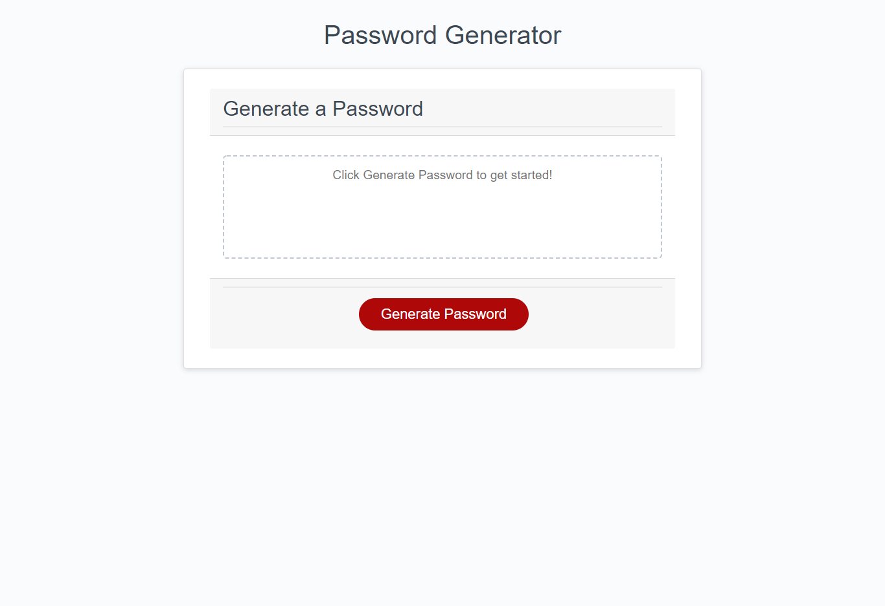

# Unit 03 Password Generator #
## User Story ##
* Created this password generator to help me better understand the different capabilities and flexibility javascript has.
* Javascipt is a beast of language and their is a million ways to do one thing, this project alone has taught me the importance of slowing and simplifying the code. Take it one step at a time.
* I have a long ways to go when it comes to javascript and did my best with this project, but im excited to see where im at in 5 months.
* This project solves a particular issue I have with weak passwords that are easly hacked
* ## Features ##
* To get started on generating your own password, click the "Generate Password" button and select your desired characters and length!
* You can select password length, Uppercase, lowerCase, specialCharacters, or numbers. Choose what works for you!
## Installation ##
1. Open up git bash terminal
2. Change directory to desired location (%User Profile%/SourceRepo)
3. Clone the repository (git clone git@github.com:ChristianGoldman/JS-Password-Generator.git)
## Usage ##
1. Open index.html in browser.
2. Should see a page like this.

## Credits ##
* Cwerness gitlab
* https://www.w3schools.com/js/default.asp
* https://developer.mozilla.org/en-US/docs/Web/JavaScript/Reference/Global_Objects/Math/random (getRandomInt)
* https://bost.ocks.org/mike/shuffle/
* https://validator.w3.org/nu/#l9c53
* https://www.dyn-web.com/javascript/strings/split.php
* https://www.tutorialspoint.com/what-is-fisher-yates-shuffle-in-javascript
* BCA learning assistants
* TA's paul hendrickson and Tommy Boone
## Link to deployed application ##
* https://christiangoldman.github.io/JS-Password-Generator/
## License ##
    MIT License

    Copyright (c) [2020] [Christian Goldman]

    Permission is hereby granted, free of charge, to any person obtaining a copy
    of this software and associated documentation files (the "Software"), to deal
    in the Software without restriction, including without limitation the rights
    to use, copy, modify, merge, publish, distribute, sublicense, and/or sell
    copies of the Software, and to permit persons to whom the Software is
    furnished to do so, subject to the following conditions:

    The above copyright notice and this permission notice shall be included in all
    copies or substantial portions of the Software.

    THE SOFTWARE IS PROVIDED "AS IS", WITHOUT WARRANTY OF ANY KIND, EXPRESS OR
    IMPLIED, INCLUDING BUT NOT LIMITED TO THE WARRANTIES OF MERCHANTABILITY,
    FITNESS FOR A PARTICULAR PURPOSE AND NONINFRINGEMENT. IN NO EVENT SHALL THE
    AUTHORS OR COPYRIGHT HOLDERS BE LIABLE FOR ANY CLAIM, DAMAGES OR OTHER
    LIABILITY, WHETHER IN AN ACTION OF CONTRACT, TORT OR OTHERWISE, ARISING FROM,
    OUT OF OR IN CONNECTION WITH THE SOFTWARE OR THE USE OR OTHER DEALINGS IN THE
    SOFTWARE.